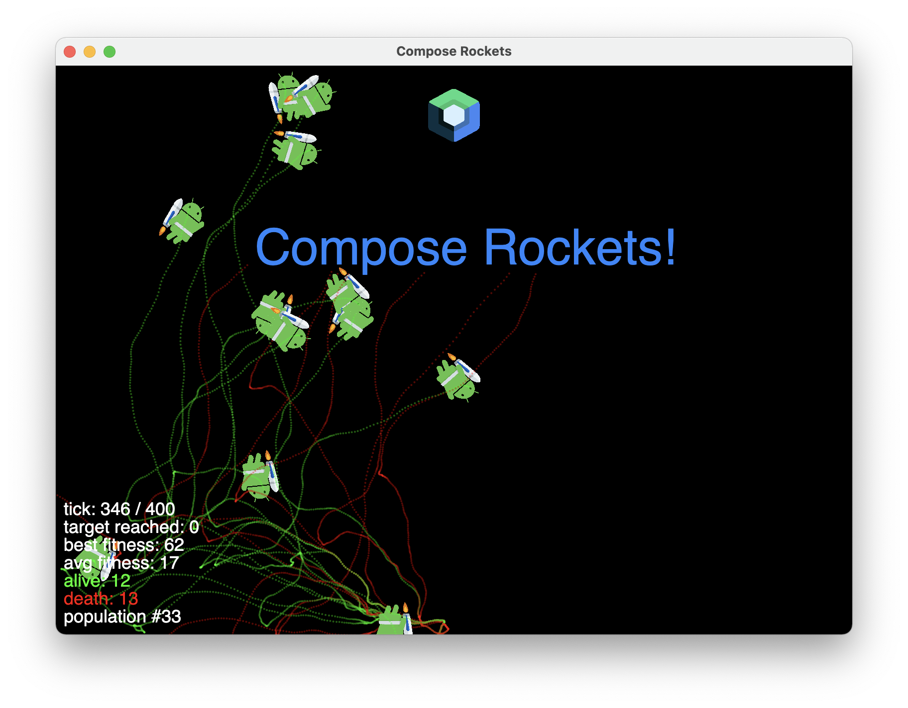

# Compose Rockets!

Smart Rockets implementation using Kotlin & Jetpack Compose for Desktop.

Rockets trying to reach the target, flying around obstacles.
Each rocket has a unique DNA set that helps them evolve and perform.

Simulation is based on the implementation of [genetic algorithm](https://en.wikipedia.org/wiki/Genetic_algorithm).

Thanks for the inspiration [the coding train](https://thecodingtrain.com/CodingChallenges/029-smartrockets.html)!
